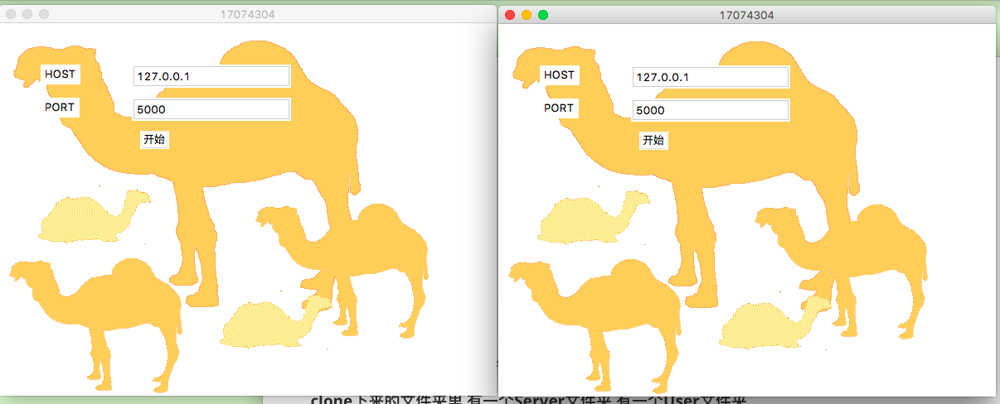
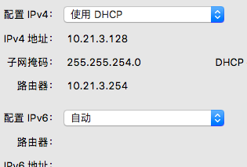
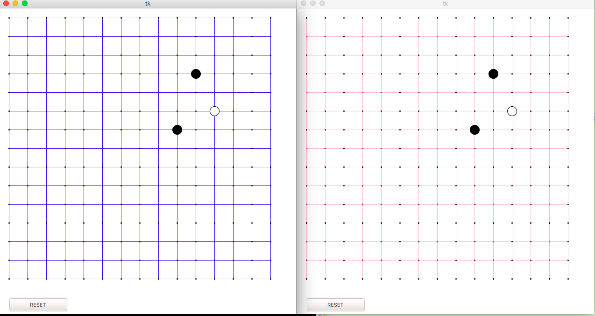

## 五子棋小游戏

### 开发运行环境

+ #### python3.7

+ #### tkinter

### 运行方法

```bash
$ git init
```

```bash
$ git clone git@github.com:wangzitiansky/Chess.git
```

#### clone的文件夹里 有一个Server文件夹 有一个User文件夹

#### 分别运行两个文件夹中的main.py文件

#### 运行效果如下



#### HOST填入IPV4地址：系统偏好设置 -> 网络 -> 高级 -> TCP/IP



#### PORT填入两个相同的四位数字

#### Server先按开始按钮开始游戏 之后User再按下开始按钮

### 局域网对战效果如下



#### 棋盘设计参考了

https://github.com/Jamesxu182/Gomoku

